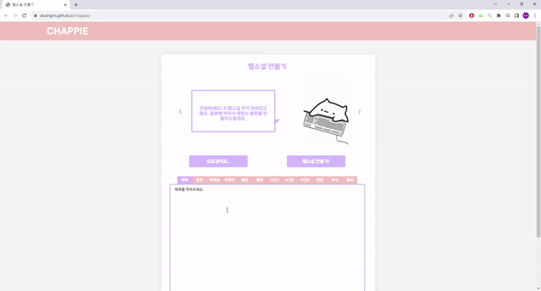
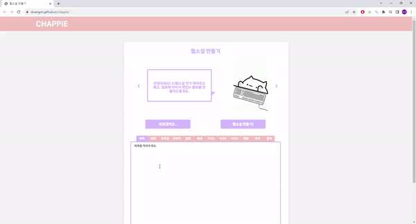
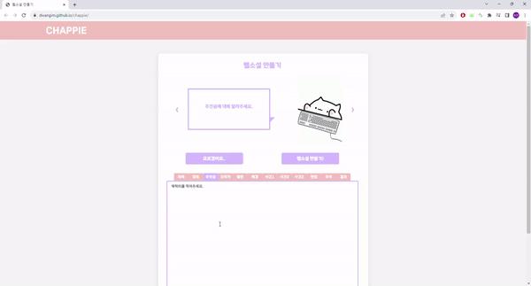
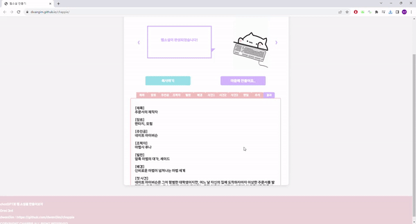
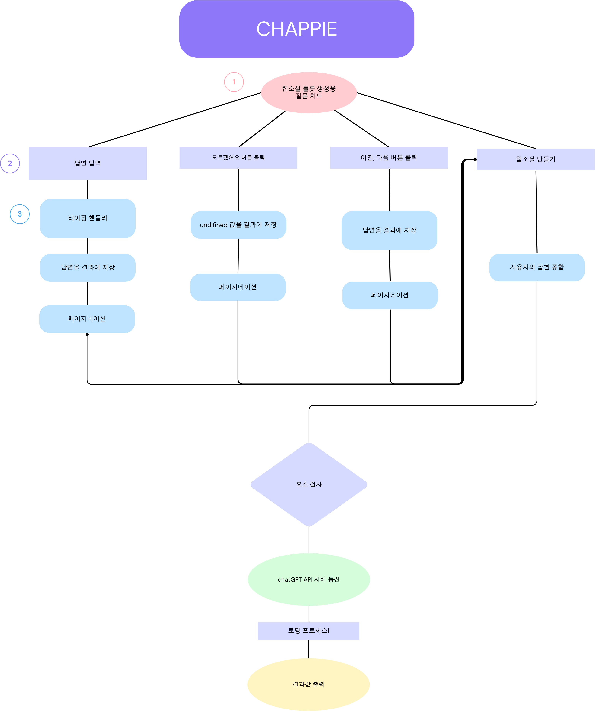

##### chatGPT API를 이용해 웹소설 플롯을 작성할 수 있습니다.
##### 사용자는 형식에 따라 질문에 답하여 새로운 이야기를 만들어낼 수 있습니다.
___


## 1. 사용 스택

  

 -----------


## 2. 프로젝트 소개 및 구현된 기능


- 장르, 제목, 주인공에 대한 미진한 구상만으로도 AI의 도움으로 웹소설의 플롯을 완성할 수 있습니다.


- 제목, 장르, 주인공, 서브주인공, 악당, 배경, 사건1, 사건2, 사건3, 결말, 주제에 관한 11가지 질문 형식의 페이지 구축


- 탭 버튼 조작과 화살표 버튼, 확인 버튼 등을 이용한 페이지네이션


- 채피와 간단한 상호작용을 할 수 있는 메세지 및 버튼 텍스트


- 버튼 클릭 및 타이핑에 대한 이벤트 리스너로 편안한 사용자 경험


- chatGPT API 연동으로 AI가 구성한 웹소설 플롯 결과를 제공.


- 복사하기 및 재질문 기능


- 부드러운 색상 변경 CSS 처리


--------------

## 3. 시작하기


https://dwangim.github.io/chappie/ 로 채피에 접속하세요.

11가지 질문에 대한 화살표 조작과 질문 스킵하기, 또는 탭 버튼 조작으로 자신의 구상을 채피에게 이야기해주세요.

더 설명하지 못한 이 이야기 만의 멋진 장점이 있으시다면 주석 란에 빠짐없이 작성해주세요. 기대하고 있겠습니다.

혹시 아무런 아이디어가 없으셔도 괜찮습니다. 모든 질문을 스킵하고 채피에게 모든 걸 맡겨보세요.











다양한 버튼 조작을 통해 질문에 답변하고 결과물을 복사할 수 있습니다.
마음에 들지 않는다면 생성된 플롯을 초기화하세요.


-------------
## 4. 코드 예시


</img>


이 HTML페이지는 자바스크립트 함수의 온클릭 함수와 이벤트리스너 등으로 분기조건이 구성되어 있습니다.
같은 버튼을 사용하더라도 출력한 결과물이 있는지, 답변한 내용이 있는지, 현재 페이지에서 보여주어야할 화면이 무엇인지에 대하여.
사용자가 최대한 불편함을 느끼지 않도록 설계하였습니다.


```javascript
function goAheadCat(num) {
    let theCatSays;
    if(!isReplying){
        const catSaysIndex = num-1;
        theCatSays = speechBubbleStr[catSaysIndex];
    }else{
        const catSaysIndex = num-1;
        theCatSays = replyingSpeechBubble[catSaysIndex];
    }
    document.getElementById('catSay').innerText = theCatSays;
}

```


API 통신 후 받아온 플롯이 있을 때 고양이의 대사를 화면에 출력하는 예시입니다.


```javascript
function outputToTextarea(output) {
    
    for (let index = 0; index < textareaIdList.length; index++) {
        const textareaId = textareaIdList[index];
        const startMarker = outputStrList[index];
        const endMarker = outputStrList[index + 1];
        const slicedText = sliceText(output, startMarker, endMarker);
        document.getElementById(textareaId).value = slicedText;
    }
}

function sliceText(inputText, startMarker, endMarker) {
    const startIndex = inputText.indexOf(startMarker);
    const endIndex = inputText.indexOf(endMarker);
    return inputText.slice(startIndex, endIndex).trim();
}

```


위는 사용자가 입력한 답변을 각각의 textarea에서 받아와 결과 탭에 출력하는 예시입니다.


```javascript
function generateWebNovel() {

    moveToPage(TOTAL_PAGE);
 
    const title = "[제목]" + document.getElementById('title').value || "[제목]";
    const genre = "[장르]"+document.getElementById('genre').value || "[장르]";
    const mc = "[주인공]"+document.getElementById('mc').value || "[주인공]";
    const sc = "[조력자]"+document.getElementById('sc').value || "[조력자]";
    const antagonist = "[빌런]"+document.getElementById('antagonist').value || "[빌런]";
    const background = "[배경]"+document.getElementById('background').value || "[배경]";
    const event1 = "[첫 사건]"+document.getElementById('event1').value || "[첫 사건]";
    const event2 = "[두번째 사건]"+document.getElementById('event2').value || "[두번째 사건]";
    const event3 = "[세번째 사건]"+document.getElementById('event3').value || "[세번째 사건]";
    const ending = "[엔딩]"+document.getElementById('ending').value || "[엔딩]";
    const moral = "[덧붙여서..]"+document.getElementById('moral').value || "[덧붙여서..]";
    
    let output = `
        ${title}
        ${genre}
        ${mc}
        ${sc}
        ${antagonist}
        ${background}
        ${event1}
        ${event2}
        ${event3}
        ${ending}
        ${moral}
    `;
    if(isReplying){
        const check = confirm("이미 작성된 플롯을 지우고 새로운 웹소설을 만드시겠습니까?");
        
        if(check){
            resetNovel();
            output = "";
            return;
        }else{
            return;
        }
    }

    data.push({
        "role": "user",
        "content": output
    });
    $textarea.value = '';
    // console.log(output);
    chatGPTAPI();
}
```


사용자의 답변을 통해 웹소설을 요청할 데이터의 구조를 만들고 api 요청을 수행해주는 가장 중요한 함수입니다.


- 또한 사용자들에게 쾌적한 이용 경험을 제공해주고자 css 함수를 사용하였습니다.


```css
.onclickBtn {
    display: block;
    width: 30%;
    padding: 12px;
    margin-top: 2em;
    margin-bottom: 2em;
    background-color: #d6bbff;
    border: none;
    border-radius: 5px;
    color: #fff;
    font-size: 16px;
    cursor: pointer;
    transition: background-color 0.3s;
    
}

.onclickBtn:hover
/*, .onclickBtn:focus, */
{
  background-position: 100% 0; /*배경 위치 변경 가로 100 세로 0*/
  /* background-color: aquamarine; */
  background-color: #e38a8a; 
  -o-transition: all .4s ease-in-out; /*트랜지션 정의 .4s지속시간  ease-in-out함수지정 */
  -webkit-transition: all .4s ease-in-out;
  transition: all .4s ease-in-out;
}
```


그 밖에도 목업페이지 prac.html을 통한 테스트와 디버깅으로 편의 기능을 개발하여, 사용자가 웹페이지 경험에 대해 불편함이 없고자 노력하였습니다.


------------


## 5. 참고


이 프로젝트는 ChatGPT API를 활용한 개인 교습용 예제로 제작되었습니다.


1. ChatGPT 연동문서
https://paullabworkspace.notion.site/ChatGPT-eb9761e8baae41ce9f7c405df8e19786

2. special thx to bongo.cat
https://bongo.cat/


